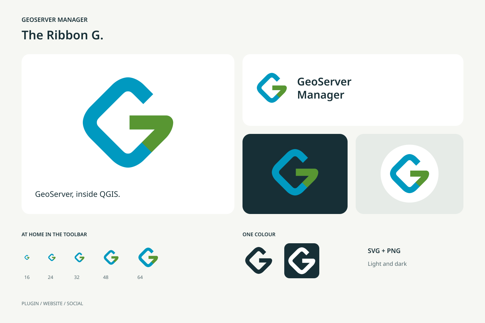

# Branding



The Ribbon G is the GeoServer Manager logo. A blue ribbon follows the outline
of a rounded map tile, then bends inward in green to form a G. The diamond and
blue reference GeoServer, while the green connects the identity to QGIS.
The open shape works at toolbar size and in a single colour.

## Downloads

[Download the complete brand kit](static/branding/brand-kit.zip).

| Use | Files |
| :-- | :-- |
| Scalable icon | [Colour SVG](static/branding/mark.svg), [dark SVG](static/branding/mark-mono.svg), [white SVG](static/branding/mark-white.svg) |
| Transparent PNG | [16 px](static/branding/icon-16.png), [24 px](static/branding/icon-24.png), [32 px](static/branding/icon-32.png), [64 px](static/branding/icon-64.png), [128 px](static/branding/icon-128.png), [256 px](static/branding/icon-256.png), [512 px](static/branding/icon-512.png) |
| Website header | [Wordmark SVG](static/branding/wordmark.svg), [PNG](static/branding/wordmark.png), [white-text SVG](static/branding/wordmark-white.svg) |
| Browser favicon | [Multi-size ICO](static/branding/favicon.ico), [SVG](static/branding/mark.svg) |
| Social avatar, 1024 × 1024 | [Light PNG](static/branding/avatar.png), [dark PNG](static/branding/avatar-dark.png), [editable SVG](static/branding/avatar.svg) |
| Social sharing, 1200 × 630 | [PNG](static/branding/social-card.png), [editable SVG](static/branding/social-card.svg) |

The avatars include room for circular profile crops. PNGs are ready to upload.
Use SVGs for websites and resizing. The wordmark uses DejaVu Sans with a
sans-serif fallback. The icon itself has no font dependency.

## Colours and spacing

| Colour | Hex | Role |
| :-- | :-- | :-- |
| Green | `#589632` | Inward bend forming the G |
| Blue | `#0099C0` | Outer map-tile ribbon |
| Ink | `#172F36` | Text, dark background, single-colour mark |
| Paper | `#F6F7F3` | Light background |

Keep the icon square. In standalone layouts, leave clear space of at least one
eighth of its width outside the canvas. At 16 px, use the symbol alone. Use the
white version on busy or coloured backgrounds where the full-colour mark has
insufficient contrast. Avoid adding outlines, gradients or shadows.

Visual references: [QGIS's green](https://www.qgis.org/styleguide/)
and [GeoServer's blue geographic diamond](https://geoserver.org/).
The artwork is drawn from scratch for GeoServer Manager, an independent plugin.

## Updating the assets

The source SVG, this guide, the exporter and the generated assets are maintained
together in this repository. Regenerate the exports whenever the source changes.

Edit `geoserver_manager/resources/images/geoserver_manager.svg`, then run from
the repository root with PyQt5 and Pillow available:

```sh
QT_QPA_PLATFORM=offscreen python3 scripts/export_branding.py
```

The script regenerates `docs/static/branding/` and the 256 px
`resources/images/default_icon.png` used by the plugin metadata. The toolbar,
menus and settings render the source SVG through the shared icon renderer.
The existing PNG filename is retained for compatibility.
The website uses the SVG and multi-size favicon. The exporter adds no runtime
dependency to the plugin or build dependency to the documentation website.

## Interface icons

All icons supplied by the plugin use original SVG artwork. Navigation, row
actions, settings, help and the layer-tree menu share the same family.
The [icon catalogue](development/icon-catalog.md) tracks every icon's meaning,
source, usage and artwork status, with an interactive visual gallery. Read the
[icon style guide](development/icon-style-guide.md) for drawing rules, shared
symbols, an SVG starter and a reusable generation brief.

`geoserver_manager/resources/icons/catalog.json` is the source of truth.
Use an icon's registered ID with `gui/icons.py`; do not add direct QGIS theme
lookups. A temporary fallback must be registered as `needs-custom` with its
filename and design notes, so unfinished artwork stays visible in the gallery.

Interface SVGs use a 24 × 24 canvas, 1.2-unit strokes, round caps and round
joins. At the dialog's 20 px display size, strokes are one logical pixel wide.
Keep shapes legible at 16 px. Upward arrows mean publishing or uploading to
GeoServer; downward arrows mean bringing content back to QGIS or disk. The
Ribbon G keeps its existing proportions as the brand mark.

Source colours name roles: `#172f36` for text, `#0099c0` for blue,
`#589632` for green and `#b3261e` for destructive actions. The renderer uses
the widget's own text and selection colours and the catalogue's light or dark
accents. Selected icons use highlighted text; disabled icons use disabled
text. Preserve labels, tooltips and accessible names when changing artwork.

After editing the catalogue or artwork:

```sh
python scripts/build_icon_catalog.py
python scripts/build_icon_catalog.py --check
QT_QPA_PLATFORM=offscreen QT_SCALE_FACTOR=2 python3 scripts/capture_screenshot.py
```

The gallery shows normal, selected and disabled states at several sizes.
Review it in light and dark themes before accepting a new icon.
