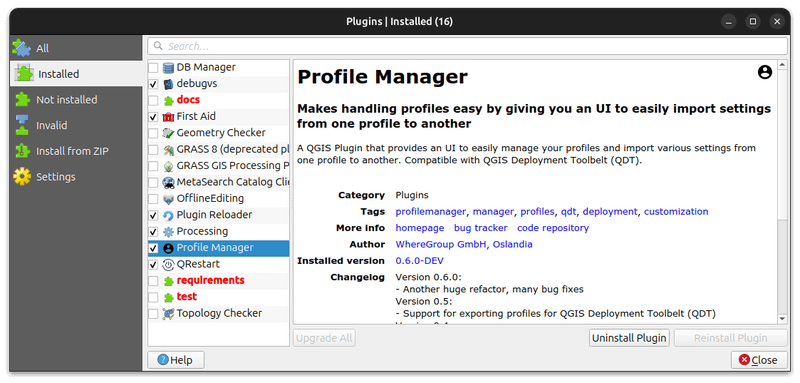

# Development

## Environment setup

> Typically on Ubuntu (but should also work on Windows with potential small adjustments).

### 1. Install virtual environment

Using [qgis-venv-creator](https://github.com/GispoCoding/qgis-venv-creator) (see [this article](https://blog.geotribu.net/2024/11/25/creating-a-python-virtual-environment-for-pyqgis-development-with-vs-code-on-windows/#with-the-qgis-venv-creator-utility)) through [pipx](https://pipx.pypa.io) (`sudo apt install pipx`):

```sh
pipx run qgis-venv-creator --venv-name ".venv"
```

Then enter into the virtual environment:

```sh
. .venv/bin/activate
# or
source .venv/bin/activate
```

Old school way:

```bash
# create virtual environment linking to system packages (for pyqgis)
python3 -m venv .venv --system-site-packages
source .venv/bin/activate
```

### 2. Install development dependencies

```sh
# bump dependencies inside venv
python -m pip install -U pip
python -m pip install -U -r requirements/development.txt

# install git hooks (pre-commit)
pre-commit install
```

### 3. Dedicated QGIS profile

It's recommended to create a dedicated QGIS profile for the development of the plugin to avoid conflicts with other plugins.

1. From the command-line (a terminal with qgis executable in `PATH` or OSGeo4W Shell):

    ```sh
    # Linux
    qgis --profile plg_geoserver_manager
    # Windows - OSGeo4W Shell
    qgis-ltr --profile plg_geoserver_manager
    # Windows - PowerShell opened in the QGIS installation directory
    PS C:\Program Files\QGIS 3.40.4\LTR\bin> .\qgis-ltr-bin.exe --profile plg_geoserver_manager
    ```

1. Then, set the `QGIS_PLUGINPATH` environment variable to the path of the plugin in profile preferences:

    

1. Finally, enable the plugin in the plugin manager (ignore invalid folders like documentation, tests, etc.):

    

## A local GeoServer to test against

`docker-compose.yml` in the repo root starts a throwaway GeoServer and a PostGIS
database:

```sh
docker compose up -d
docker compose ps          # wait until gsm-geoserver is "healthy"
```

| | |
| :--- | :--- |
| GeoServer | <http://localhost:8080/geoserver> — `admin` / `geoserver` |
| Database, as seen *from GeoServer* | host `postgis`, port `5432`, database / user / password `geoserver` |

Configure the plugin with that URL and those credentials in *Settings → Options →
GeoServer Manager*.

The server comes up with GeoServer's demo data: 8 workspaces, 5 datastores, 24
layers, 21 styles and 3 layer groups — enough for the list views, search and
pagination to show something real, and for the upcoming Layers/Styles tabs to
have resources to list. Note that 4 of the 5 demo datastores are Shapefile or
GeoPackage, types the plugin cannot edit, so clicking one opens the read-only
dialog (see issue #28).

For the empty first-run state — "no workspaces yet", which the Add flows and the
"create a workspace first" warning are about:

```sh
docker compose down -v && SKIP_DEMO_DATA=true docker compose up -d
```

The `-v` matters: the demo data is unpacked only when the data-dir volume is
created, so flipping the variable on an existing volume changes nothing.

PostGIS is part of the stack on purpose — "PostGIS" is the plugin's main
datastore type, and without a reachable database a created store looks fine but
serves nothing, so the interesting edit behaviour cannot be exercised. Use the
`postgis` host name, not `localhost`: GeoServer resolves it on the compose
network, which is why the database port is not published to the host.

A PMTiles datastore *config* can be created against vanilla GeoServer, but
serving from one needs the community module — see the commented
`COMMUNITY_EXTENSIONS` lines in `docker-compose.yml`.

```sh
docker compose down -v     # stop and discard both volumes
```

### 4. Load the plugin: symlink (alternative to `QGIS_PLUGINPATH`)

Instead of the environment variable, symlink the `geoserver_manager` package
into the profile's plugin folder — QGIS then loads the working tree directly and
only sees the plugin package, not the repo's `docs/`, `tests/` and friends:

```sh
# Linux, dedicated profile
ln -s "${PWD}/geoserver_manager" \
  "$HOME/.local/share/QGIS/QGIS3/profiles/plg_geoserver_manager/python/plugins/"
```

On macOS the profiles live in `$HOME/Library/Application Support/QGIS/QGIS3`, on
Windows in `%APPDATA%\QGIS\QGIS3` (use `New-Item -ItemType SymbolicLink` from an
administrator PowerShell).

There is no build step: the `geoservercloud` and `xmltodict` wheels in
`geoserver_manager/extras/` are committed. Restart QGIS or use
[Plugin Reloader](https://plugins.qgis.org/plugins/plugin_reloader/) to pick up
code changes.
