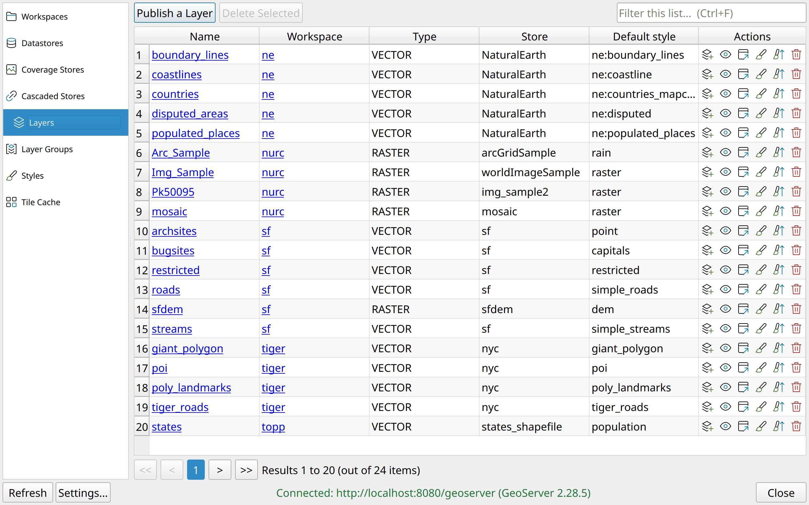

# Using the plugin

## Connect

*Settings → Options → GeoServer Manager* (or the plugin menu's *Settings*
entry):

| Field | Notes |
| :---- | :---- |
| Base URL | e.g. `https://example.com/geoserver`, must start with `http://` or `https://` |
| Username / Password | kept encrypted in the QGIS authentication database; QGIS asks for its master password |
| Verify the server's TLS certificate | on by default; untick only for a private CA or a self-signed certificate you trust |
| Test connection | probes the server with the fields as typed, without saving them |

Then click the toolbar icon. The dialog connects in the background and the
status line reads *Connected: url (version)*. *Refresh* (F5) reconnects and
reloads the open tab. When something is wrong the status line says what:

| Status | Meaning | What to do |
| :----- | :------ | :--------- |
| Not configured | no URL or credentials saved | open Settings |
| Server unreachable | nothing answers at that host and port (after 10 s at most) | check the URL, the network, that GeoServer is running |
| Certificate not trusted | TLS certificate this machine does not trust | fix the CA, or untick the verification for a certificate you trust |
| Authentication failed | GeoServer answered 401/403 | check username and password |
| HTTP error *N* | the URL answers, but not with the REST API (a wrong path) | check the URL, it should end in `/geoserver` |
| Not a GeoServer REST endpoint | an HTML page came back (a proxy login page, a portal) | check the URL, or the proxy in front of GeoServer |

Details for every failure go to the QGIS log panel, *GeoServer Manager* tab.
Over plain `http://` to a remote host the password travels unencrypted; the
plugin says so once, when saving.

## The dialog

The list on the left picks the resource type; the table on the right shows it.
Navigation and row-action icons adapt to light and dark themes. Hover over an
action for its explanation; each action also has a name for screen readers.
Style-transfer icons put a full-height arrow beside the brush: up sends a
style to GeoServer, down brings it into QGIS.

- **Search** (Ctrl+F) filters every column of the loaded list; Esc clears it.
- **Sort** by clicking a column header; click again to reverse. The sort stays
  through a refresh and resets when you change tab.
- **Pages** of 20 rows; the buttons under the table move between them.
- **Names** are links: click one (or select the row and press Enter) to open
  the resource's details. The *Workspace* column jumps to that workspace.
- **Actions**: the button above the table adds or publishes, *Delete Selected*
  removes every highlighted row (Del does the same while the table has the
  focus), and the right-hand column holds the per-row actions.
- Lists load in the background: QGIS stays usable, the task bar shows the
  progress, and *Refresh* turns into *Cancel* while a load runs.

Every delete asks first and names what it cascades to; GeoServer deletes
recursively (a workspace takes its stores, layers and styles with it).

## Workspaces

*Add a Workspace*: name, optionally isolated, optionally the default. Click a
name for *Modify workspace settings*: rename, toggle isolation, make it the
default (GeoServer always has exactly one default workspace, so the box is
read-only on the current one), and, under *WMS*, the workspace's own WMS
service settings (*Own WMS settings*): title, abstract, keywords, SRS list,
rendering limits, default locale. Unticking *Own WMS settings* removes them
and the workspace falls back to the global WMS configuration.

## Datastores

Listed across every workspace. *Add a Datastore* offers PostGIS, PostGIS
(JNDI), PMTiles, Shapefile, *Directory of spatial files (shapefiles)*,
GeoPackage and *Web Feature Server (NG)* (a remote WFS cascaded as a
datastore, whose feature types then publish like tables) with a form each;
any other type gets a *Connection parameters*
editor, one `key = value` per line, exactly as GeoServer stores them.

Click a name to modify a store, or to enable or disable it. GeoServer
disables a store itself when its connection fails at startup. A datastore
cannot be renamed. The password is
never shown (GeoServer only returns it encrypted), so the field is blank when
you edit: leave it empty to keep the stored password, type to replace it. Everything the
form does not show (extra parameters, the `enabled` flag) is kept as the
server has it.

## Coverage stores

*Add a Coverage Store* from a GeoTIFF path on the GeoServer machine, a COG URL,
or an ImageMosaic (a server directory, or a properties ZIP to upload). The
*Coverages* action lists the coverages of a store: native name, SRS, size in
pixels, bounds, bands, and *Publish a coverage* makes one of them a layer,
with a title, an abstract, keywords and the layer name.

The fifth source, **A raster layer from this QGIS project**, publishes a raster
of the open project: it is written to a tiled, compressed GeoTIFF (or sent as
it is when the layer already is a plain local GeoTIFF) and uploaded, and
GeoServer creates the store, the coverage and the layer in that one request.
Tick *Replace it if it already exists* to overwrite a previous upload. The
upload runs as a QGIS task: the task bar shows the progress, the dialog stays
usable, and *Cancel* (the Refresh button while it runs) aborts the transfer;
the message then says what GeoServer kept. A layer without a CRS, or with one
that has no EPSG code, is refused before anything is sent.

## Cascaded stores

The WMS and WMTS stores that proxy another server, listed across every
workspace with their type and capabilities URL. *Add a Cascaded Store*: type,
workspace, name and the remote GetCapabilities URL. Row actions: **Cascaded
layers** (the layers already published from this store, with their details;
delete one from the Layers tab), **Publish a layer** (pick one of the layers the remote
advertises, under its own name or one of yours; GeoServer reads title, SRS
and bounds from the remote capabilities), **Delete**. The remote server is
never touched.

## Layers

Every layer of the server whatever its type, vector, raster, cascaded WMS or
WMTS, with its workspace, type, store and default style. Click a name for the
details: a vector layer's native name, projection policy, bounding box,
attributes and metadata; a raster's coverage details; a cascaded layer's remote
name and store.

*Publish a Layer* has two sources:

- **A table in a datastore**: pick workspace, datastore and table, give the
  EPSG code of its SRS (look it up in the table's geometry column; GeoServer's
  web UI can compute it), add title, abstract and keywords.
- **A layer from this QGIS project**: a vector layer is written to a GeoPackage
  and uploaded; GeoServer creates a datastore of that name and publishes the
  layer in one request, and the layer's QGIS symbology is uploaded as its
  default style. A raster layer goes the way the Coverage Stores tab sends it:
  a GeoTIFF, uploaded and published as a coverage. Tick *Replace it if it already exists* to overwrite a previous upload.
  The layer's name is made GeoServer-safe first (spaces and accents become
  `_`). The upload runs as a QGIS task with progress and *Cancel*; a layer
  whose CRS has no EPSG code is reprojected to EPSG:4326 on the way.

The row actions appear in this order:

| Icon | Action | What it does |
| :--- | :----- | :----------- |
| Layers with a plus | **Add to QGIS** | Load as WMS, WMTS or, for a vector layer, WFS. Credentials travel as a QGIS authentication configuration, so a saved project never contains a password. |
| Eye | **Preview** | Show the layer on a map inside QGIS. Drag to pan, scroll to zoom, and click for feature info. Nothing is added to the project. |
| Browser with an outward arrow | **Preview in a browser** | Open GeoServer's OpenLayers page on the layer's extent. A secured server asks the browser to log in. |
| Brush | **Set style** | Pick the default style from the server's existing styles. |
| Brush with an upward arrow | **Push style from QGIS** | Upload a project layer's symbology and make it the default. Replacing an existing style asks first, because every layer using it would change. |
| Bin | **Delete** | Remove the layer from GeoServer after confirmation. |

## Layer groups

Global groups and per-workspace groups; the *Workspace* column shows
`(global)` for the former. *Create a Layer Group*: name, title, abstract,
mode, then the layers in order (*Add a layer* appends one, with its style);
GeoServer computes the bounds. **Add to QGIS** loads the group as a WMS layer; **Preview in a browser** opens
it on GeoServer's OpenLayers page.
The detail dialog is read-only: to change a group, create it again or delete
it.

## Styles

Global and per-workspace styles, with their format and SLD version.
*Upload a Style* takes its definition from three sources: **Paste SLD**,
**From file** (`.sld`, a `.zip` with an SLD and its resources, `.mbstyle`), or
**From a QGIS layer** (the project layer's symbology exported as SLD 1.1).
Click a name to view and modify the definition (GeoServer shows a stored
SLD 1.1 document in its 1.0 rendition; the editor says so), next to the legend
GeoServer renders for the style, fetched while the dialog is open, with a
problem explained in its place rather than a broken image.

Row actions: **Apply to a QGIS layer** (pick a project layer and get the
server's style on it), **Save to disk** (the definition, whatever its format),
**Delete** (GeoServer refuses
to delete a style that a layer still uses).

## Tile cache

What GeoWebCache caches: by default every layer and every layer group, listed
with their gridsets and formats (the *Workspace* column reads `(global)` for a
global group). Click a name to edit the caching: enabled, gridsets (*Add a
gridset* picks from the server's list), formats and, under *Advanced*,
meta-tiling, gutter and expiry. Row actions: **Truncate** (deletes the cached
tiles, after confirmation; they are rendered again on demand), **Remove from
cache** (the layer itself stays published). The eraser with a flat lower edge
clears tile content; the minus icon stops caching. *Add a Layer to the Cache*
offers the published layers and groups that are not cached yet.

## From the layer tree

Right-click a vector or raster layer in QGIS's layer tree for the **GeoServer
Manager** submenu:

- **Push style to GeoServer…**: the layer's symbology becomes the matching
  server layer's style, after a confirmation that names the target and lets you
  choose the style name and whether it becomes the layer's default.
- **Apply style from GeoServer…**: the server layer's style on the QGIS layer,
  with a picker when it has several.

A layer loaded from the server (WFS, WMS, WMTS) is matched through its source;
any other layer by name, `workspace:` prefix or not. Without a connection the
entries are disabled and say so, next to an entry that opens the plugin.
Outcomes appear in QGIS's own message bar.

## Keyboard

| Key | Does |
| :-- | :--- |
| F5 | refresh: reconnects and reloads the open tab |
| Ctrl+F | jump to the search box |
| Esc | clear the search; with an empty search, close the dialog |
| Enter | open the selected row |
| Del | delete the selected rows (while the table has the focus) |

## Good to know

- Nothing is cached: every tab switch and every *Refresh* fetches the list
  again, and every form fetches its options when it opens.
- Deleting a datastore or coverage store created from an upload leaves the
  uploaded file in GeoServer's data directory.
- The plugin's TLS setting does not reach QGIS's own WMS/WFS providers: a
  layer added to QGIS uses QGIS's certificate handling.
- The interface follows the QGIS theme, dark ones included, and is translated
  where a locale exists (a partial French one so far, contributions welcome, see the
  translation page).
